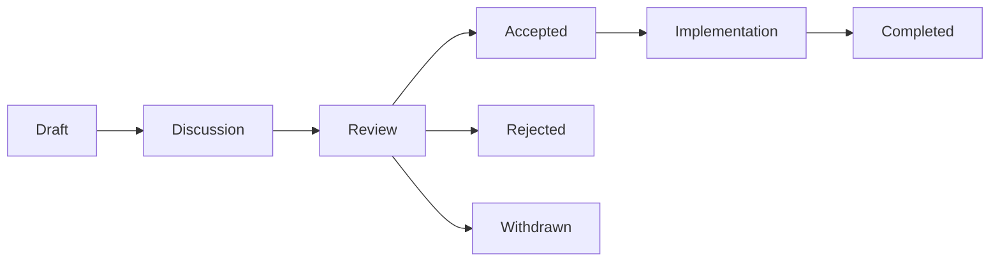

# Prism Enhancement Proposal (PEP) Template & Process

## What is a PEP?

A Prism Enhancement Proposal (PEP) is a design document providing information to the Prism community, describing a new feature, process, or environment. PEPs are the primary mechanism for proposing major new features, collecting community input, and documenting design decisions.

## PEP Types

- **Feature**: New language feature or significant change
- **Process**: Process improvement or community guideline  
- **Informational**: General guidelines or information
- **Standard**: Technical standard or protocol

## PEP Workflow



## PEP Numbering

- PEPs are numbered sequentially starting from PEP-001
- Core team assigns numbers when draft is submitted
- Special numbers:
  - PEP-001: This process document
  - PEP-XXX0: Milestone/Meta PEPs (e.g., PEP-100, PEP-200)

---

# PEP-TEMPLATE

**PEP**: [Number assigned by core team]  
**Title**: [Descriptive title]  
**Author**: [Your name <email@example.com>]  
**Champion**: [Core team member - to be assigned]  
**Status**: Draft  
**Type**: [Feature | Process | Informational | Standard]  
**Created**: [YYYY-MM-DD]  
**Updated**: [YYYY-MM-DD]  
**Requires**: [List of PEP dependencies]  
**Replaces**: [PEP number if superseding]  
**Superseded-By**: [PEP number if superseded]

## Abstract

[A short (~200 word) description of the technical issue being addressed. This should be understandable by someone not familiar with the detailed background.]

## Motivation

[Clearly explain why the existing language specification is inadequate to address the problem that the PEP solves. Include code examples of problems that exist today.]

```prism
// Example of current limitation
// Show why this is problematic
```

## Rationale

[Describe why particular design decisions were made. What alternatives were considered and why were they rejected? How does this feature interact with existing features?]

## Specification

[The technical specification should describe the syntax and semantics of any new language feature. Be as precise as possible.]

### Syntax

```ebnf
// Formal grammar additions/changes
new_feature ::= ...
```

### Semantics

[Detailed behavior description]

### Type System Integration

[How does this interact with Prism's semantic type system?]

### Examples

```prism
// Basic usage example
// Show the happy path
```

```prism
// Advanced example
// Demonstrate edge cases
```

```prism
// Error cases
// What should fail and why
```

## Backwards Compatibility

[Describe any backwards incompatibility and how to handle it. Most features should be backwards compatible.]

## Implementation

### Compiler Changes

[What changes are needed in the compiler?]
- [ ] Parser modifications
- [ ] Type checker updates
- [ ] Code generation changes

### Runtime Changes

[Any runtime modifications needed?]

### Standard Library

[New APIs or modifications needed?]

### Tooling

[IDE, formatter, linter updates required?]

### Estimated Effort

[Rough estimate of implementation complexity: Small/Medium/Large]

## Security Implications

[How could this feature be misused? Are there any security concerns?]

## Performance Impact

[Will this feature affect compilation time? Runtime performance? Memory usage?]

## How to Teach This

[How should this feature be taught to new Prism users? What terminology should we use? What examples best demonstrate the concept?]

### Documentation Plan

- [ ] Language guide section
- [ ] API documentation
- [ ] Tutorial/cookbook recipe
- [ ] Error message improvements

### Migration Guide

[For existing code, how do they adopt this feature?]

## Reference Implementation

[Link to prototype or proof of concept if available]

```prism
// Simplified implementation showing the core idea
```

## Alternatives

[What other designs were considered? Why weren't they chosen?]

### Alternative 1: [Name]
[Description and why rejected]

### Alternative 2: [Name]
[Description and why rejected]

## Unresolved Questions

[What parts of the design are still unclear? What needs community input?]

- [ ] Question 1
- [ ] Question 2

## Future Possibilities

[What future extensions could build on this?]

## References

- [Link to discussions]
- [Related PEPs]
- [Academic papers]
- [Similar features in other languages]

## Acknowledgments

[Credit those who helped with the proposal]

---

## Community Feedback

### Support

- @username1: "Clear need for this feature because..."
- @username2: "Would solve my use case of..."

### Concerns

- @username3: "Worried about complexity..."
- @username4: "Performance implications..."

### Suggestions

- @username5: "Consider also adding..."

---

## Decision

**Status**: [Accepted/Rejected/Withdrawn]  
**Date**: [YYYY-MM-DD]  
**Rationale**: [Why was this decision made?]

---

# PEP Submission Process

## 1. Pre-Proposal Discussion

Before writing a PEP:
1. Discuss the idea on Discord/forums
2. Gauge community interest
3. Search existing PEPs for similar ideas
4. Consider starting with a prototype

## 2. Finding a Champion

Feature PEPs require a champion from the core team:
- Post your idea in #pep-ideas channel
- Core team members can volunteer to champion
- Champion guides PEP through process

## 3. Writing the PEP

1. Fork the prism-lang/peps repository
2. Copy PEP-TEMPLATE.md to PEP-draft-[your-title].md
3. Fill out all sections thoroughly
4. Submit PR to peps repository

## 4. Review Process

1. **Community Review** (2-4 weeks)
   - Open discussion on PR
   - Author addresses feedback
   - Champion facilitates discussion

2. **Core Team Review**
   - Technical feasibility
   - Alignment with language goals
   - Implementation complexity

3. **Final Decision**
   - Requires consensus from core team
   - Champion presents to team
   - Decision recorded in PEP

## 5. Post-Acceptance

1. PEP merged with Accepted status
2. Implementation tracking issue created
3. PEP updated as implementation progresses
4. Marked Complete when shipped

## Good PEP Practices

### DO:
- ✅ Be specific and detailed
- ✅ Include realistic examples
- ✅ Consider edge cases
- ✅ Address backwards compatibility
- ✅ Respond to all feedback
- ✅ Update based on discussion

### DON'T:
- ❌ Submit half-baked ideas
- ❌ Ignore community feedback
- ❌ Make breaking changes lightly
- ❌ Forget about teaching/documentation
- ❌ Rush the process

## Example PEPs

### PEP-001: PEP Process (This Document)
**Status**: Accepted  
**Type**: Process

### PEP-002: Pattern Matching
**Status**: Draft  
**Type**: Feature
```prism
match value {
    Some(x) if x > 0 => x * 2,
    Some(0) => 0,
    None => default
}
```

### PEP-003: Async/Await
**Status**: Accepted  
**Type**: Feature
```prism
async function fetchUser(id: UserId) -> Result<User, Error> {
    let response = await http.get(`/users/${id}`);
    return User.parse(response.body);
}
```

### PEP-004: Const Generics
**Status**: Discussion  
**Type**: Feature
```prism
type Matrix<T, const Rows: Integer, const Cols: Integer> = {
    data: Array<T, Rows * Cols>
}
```

## PEP Hall of Fame

Exceptional PEPs that set the standard:
- PEP-XXX: [Title] - Exceptionally thorough analysis
- PEP-YYY: [Title] - Great community engagement
- PEP-ZZZ: [Title] - Excellent teaching section

---

## Appendix: Quick Reference

| Status | Description |
|--------|-------------|
| Draft | Initial version, gathering feedback |
| Discussion | Active community discussion |
| Review | Under core team review |
| Accepted | Approved for implementation |
| Rejected | Not accepted, with rationale |
| Withdrawn | Author withdrew proposal |
| Implementation | Being implemented |
| Completed | Fully implemented and shipped |
| Superseded | Replaced by another PEP |

## Links

- [PEP Repository](https://github.com/prism-lang/peps)
- [Discussion Forum](https://discuss.prism-lang.org/c/peps)
- [PEP Status Board](https://prism-lang.org/peps)
- [Core Team](https://prism-lang.org/team)