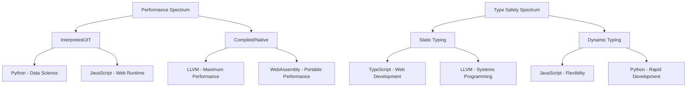

# PLD-010: Multi-Target Compilation Possibilities

**Document ID**: PLD-010  
**Status**: Draft  
**Type**: Core Language Feature  
**Author**: Prism Language Team  
**Created**: 2025-01-17  
**Last Modified**: 2025-01-17  

## Document Metadata

| Field | Value |
|-------|-------|
| **Feature Area** | Code Generation |
| **Priority** | High |
| **Dependencies** | PLT-100 (Multi-Target Code Generation), PLT-101 (Code Generation Architecture) |
| **Implementation Phase** | 2-4 |
| **Stability** | Planning |

## Abstract

This document provides a comprehensive analysis of potential compilation targets for Prism's multi-target code generation system. Building upon our existing targets (TypeScript, JavaScript, Python, LLVM, WebAssembly), we evaluate strategic opportunities for expansion including systems languages (Rust, Go, C/C++), functional languages (OCaml, F#, Haskell), and specialized targets (SQL compilation). Each target is analyzed through the lens of Prism's core design principles, market demand, implementation complexity, and strategic value to the ecosystem.

The analysis prioritizes targets that complement Prism's AI-first design philosophy, semantic type preservation, and effect system while maximizing developer productivity across diverse deployment scenarios from embedded systems to enterprise cloud infrastructure.

## Table of Contents

1. [Motivation](#motivation)
2. [Current Target Ecosystem](#current-target-ecosystem)
3. [Strategic Analysis Framework](#strategic-analysis-framework)
4. [Tier 1 Targets: High Priority](#tier-1-targets-high-priority)
5. [Tier 2 Targets: Medium Priority](#tier-2-targets-medium-priority)
6. [Tier 3 Targets: Specialized Use Cases](#tier-3-targets-specialized-use-cases)
7. [Implementation Roadmap](#implementation-roadmap)
8. [Market Analysis](#market-analysis)
9. [Technical Considerations](#technical-considerations)
10. [References](#references)

## Motivation

### Expanding Prism's Reach

Prism's current target ecosystem provides excellent coverage for web development (TypeScript/JavaScript), data science (Python), performance computing (LLVM), and portable execution (WebAssembly). However, significant gaps remain in:

- **Systems Programming**: Memory-safe systems languages
- **Cloud-Native Development**: Microservices and container-native languages  
- **Enterprise Integration**: .NET and JVM ecosystems
- **Functional Programming**: Academic and research communities
- **Specialized Domains**: Database query compilation, embedded systems

### Strategic Imperatives

1. **Market Coverage**: Compete in all major programming language segments
2. **Developer Adoption**: Meet developers where they are, not where we want them to be
3. **AI Metadata Preservation**: Maintain semantic richness across all targets
4. **Ecosystem Integration**: Leverage existing tooling and libraries
5. **Performance Spectrum**: From embedded microcontrollers to high-performance computing

## Current Target Ecosystem

### Production Targets

| Target | Status | Use Cases | Strengths | Limitations |
|--------|--------|-----------|-----------|-------------|
| **TypeScript** | Stable | Web development, Node.js | Rich tooling, type safety | Runtime overhead |
| **JavaScript** | Stable | Web deployment, legacy support | Universal compatibility | Dynamic typing |
| **Python** | Stable | AI/ML, data science, scripting | Massive ecosystem | Performance |
| **LLVM** | Stable | Native performance, systems | Maximum performance | Complex deployment |
| **WebAssembly** | Stable | Portable performance | Cross-platform | Limited ecosystem |

### Target Coverage Analysis



## Strategic Analysis Framework

### Evaluation Criteria

Each potential target is evaluated across multiple dimensions:

#### Technical Criteria (Weight: 40%)
- **Implementation Complexity**: How difficult to build and maintain?
- **Semantic Preservation**: Can we maintain Prism's type system richness?
- **Performance Characteristics**: What performance profile does it offer?
- **Tooling Integration**: How well does it integrate with existing tools?

#### Market Criteria (Weight: 35%)
- **Developer Adoption**: Size and growth of developer community
- **Industry Demand**: Enterprise and startup adoption trends
- **Competitive Landscape**: How crowded is the space?
- **Strategic Value**: Does it open new market segments?

#### Ecosystem Criteria (Weight: 25%)
- **Library Availability**: Rich standard library and third-party packages
- **Platform Support**: Cross-platform deployment capabilities
- **Community Health**: Active development and maintenance
- **Learning Curve**: Ease of adoption for Prism developers

## Tier 1 Targets: High Priority

### Rust - The Natural Choice

**Priority**: ⭐⭐⭐⭐⭐ (Immediate Implementation)

#### Strategic Rationale
Rust represents the most natural extension of Prism's target ecosystem, offering memory safety without garbage collection, zero-cost abstractions, and a rapidly growing developer community.

#### Technical Analysis

**Strengths**:
- **Perfect Semantic Alignment**: Rust's ownership model maps naturally to Prism's effect system
- **Performance**: Zero-cost abstractions, comparable to C++
- **Memory Safety**: Compile-time guarantees prevent entire classes of bugs
- **Ecosystem Growth**: 40%+ year-over-year growth in 2024
- **Tooling Excellence**: Cargo, rustfmt, clippy provide world-class developer experience

**Implementation Complexity**: 🟢 Low-Medium
- Can reuse significant portions of LLVM backend infrastructure
- Rust's borrowing semantics align with Prism's capability system
- Strong type system makes semantic preservation straightforward

**Code Generation Strategy**:
```rust
// Prism semantic types map naturally to Rust
pub struct UserId(uuid::Uuid);  // Branded type preservation
pub struct EmailAddress(String); // Validation at type boundaries

// Effect system maps to Rust's Result and trait system
pub trait DatabaseAccess {
    fn get_user(&self, id: UserId) -> Result<User, DatabaseError>;
}
```

**Market Position**:
- Systems programming (replacing C++)
- Web backends (Actix, Rocket, Axum)
- Blockchain and cryptocurrency
- CLI tools and infrastructure
- Game engine development

**Implementation Roadmap**:
1. **Phase 1**: Basic type mapping and function generation
2. **Phase 2**: Ownership and borrowing integration with effect system
3. **Phase 3**: Cargo integration and package management
4. **Phase 4**: Advanced features (macros, traits, generics)

### Go - Cloud-Native Dominance

**Priority**: ⭐⭐⭐⭐ (High Implementation Priority)

#### Strategic Rationale
Go's dominance in cloud infrastructure and microservices makes it essential for Prism's enterprise adoption. Its simplicity and excellent concurrency model complement Prism's design philosophy.

#### Technical Analysis

**Strengths**:
- **Simplicity**: Clean syntax that maps well to business logic
- **Concurrency**: Goroutines and channels for concurrent programming
- **Deployment**: Single binary deployment, excellent for containers
- **Cloud Ecosystem**: Kubernetes, Docker, cloud-native tooling
- **Fast Compilation**: Very quick build times

**Implementation Complexity**: 🟡 Medium
- Garbage collection requires careful memory management strategy
- Interface system different from Prism's trait system
- Goroutine mapping to Prism's concurrency model needs design

**Code Generation Strategy**:
```go
// Prism semantic types become Go types with validation
type UserId string
type EmailAddress string

// Effect system maps to interfaces and error handling
type UserRepository interface {
    GetUser(ctx context.Context, id UserId) (*User, error)
}

// Concurrency maps to goroutines with proper error propagation
func ProcessUsers(ctx context.Context, users []UserId) error {
    errChan := make(chan error, len(users))
    for _, userID := range users {
        go func(id UserId) {
            errChan <- processUser(ctx, id)
        }(userID)
    }
    // Error aggregation logic
}
```

**Market Position**:
- Microservices and APIs
- Cloud infrastructure tools
- DevOps and monitoring
- Network programming
- Container orchestration

**Implementation Roadmap**:
1. **Phase 1**: Basic type system and function mapping
2. **Phase 2**: Interface generation and error handling
3. **Phase 3**: Goroutine integration with effect system
4. **Phase 4**: Module system and package management

## Tier 2 Targets: Medium Priority

### C# - Enterprise Integration

**Priority**: ⭐⭐⭐ (Medium-Term Implementation)

#### Strategic Rationale
C# provides access to the massive .NET ecosystem and enterprise market. With .NET's cross-platform capabilities and strong performance, it represents significant strategic value.

#### Technical Analysis

**Strengths**:
- **Enterprise Adoption**: Dominant in enterprise development
- **Cross-Platform**: .NET Core/5+ runs everywhere
- **Rich Ecosystem**: Massive library ecosystem
- **Performance**: JIT compilation with good runtime performance
- **Tooling**: Excellent IDE support and debugging tools

**Implementation Complexity**: 🟡 Medium
- Complex type system with generics and nullable references
- Memory management via garbage collection
- Async/await model integration with effect system

**Code Generation Strategy**:
```csharp
// Prism semantic types as C# record types with validation
public record UserId(Guid Value) 
{
    public static implicit operator UserId(Guid value) => new(value);
}

// Effect system maps to async/await with Result types
public interface IUserRepository 
{
    Task<Result<User>> GetUserAsync(UserId id);
}

// Business rules as attributes and validation
[EmailValidation]
public record EmailAddress(string Value);
```

### OCaml - Functional Excellence

**Priority**: ⭐⭐⭐ (Academic and Research Focus)

#### Strategic Rationale
OCaml offers exceptional performance for functional programming while maintaining strong theoretical foundations. It appeals to academic, research, and financial modeling communities.

#### Technical Analysis

**Strengths**:
- **Performance**: Compiles to efficient native code
- **Type Safety**: Strong static typing with inference
- **Pattern Matching**: Natural fit for AST manipulation
- **Mathematical Computing**: Excellent for algorithmic work
- **Compiler Heritage**: Many successful compilers written in OCaml

**Implementation Complexity**: 🟡 Medium-High
- Different paradigm requires careful mapping
- Module system integration
- Pattern matching and algebraic data types

**Code Generation Strategy**:
```ocaml
(* Prism semantic types as OCaml variants *)
type user_id = UserId of string
type email_address = EmailAddress of string

(* Effect system as monadic computations *)
type 'a database_result = 
  | Success of 'a 
  | Error of database_error

(* Pattern matching for business logic *)
let process_user = function
  | UserId id when String.length id > 0 -> 
    (* Valid user processing *)
  | UserId _ -> 
    Error InvalidUserId
```

### Java - JVM Ecosystem

**Priority**: ⭐⭐⭐ (Enterprise Strategic)

#### Strategic Rationale
Java provides access to the massive JVM ecosystem and enterprise Java market. Despite being a mature platform, it remains dominant in enterprise development.

#### Technical Analysis

**Strengths**:
- **Enterprise Dominance**: Massive enterprise adoption
- **JVM Ecosystem**: Huge library and framework ecosystem
- **Cross-Platform**: "Write once, run anywhere"
- **Performance**: Mature JIT compilation
- **Tooling**: Excellent IDE and development tools

**Implementation Complexity**: 🟡 Medium-High
- Complex generics system
- Memory management via garbage collection
- Integration with Java's object model

## Tier 3 Targets: Specialized Use Cases

### C - Embedded and Systems

**Priority**: ⭐⭐ (Specialized Applications)

#### Strategic Rationale
C targets embedded systems, IoT devices, and system-level programming where memory footprint and direct hardware access are critical.

#### Technical Analysis

**Use Cases**:
- Embedded systems and IoT
- Operating system kernels
- Device drivers
- Real-time systems
- Legacy system integration

**Implementation Challenges**:
- Manual memory management
- Limited type system
- No built-in error handling
- Minimal standard library

### SQL Compilation - Unique Innovation

**Priority**: ⭐⭐⭐ (Differentiation Strategy)

#### Strategic Rationale
SQL compilation represents a unique market opportunity. No other general-purpose language offers compilation to SQL dialects, potentially giving Prism a distinctive competitive advantage.

#### Technical Analysis

**Target SQL Dialects**:
- **PostgreSQL**: Advanced features, JSON support, window functions
- **SQLite**: Embedded database scenarios
- **BigQuery**: Data warehouse and analytics
- **Snowflake**: Cloud data platform

**Code Generation Strategy**:
```sql
-- Prism semantic types as SQL domains
CREATE DOMAIN user_id AS UUID;
CREATE DOMAIN email_address AS TEXT 
  CHECK (VALUE ~ '^[^@]+@[^@]+\.[^@]+$');

-- Business rules as constraints and triggers
CREATE TABLE users (
  id user_id PRIMARY KEY,
  email email_address UNIQUE NOT NULL,
  created_at TIMESTAMPTZ DEFAULT NOW()
);

-- Effect system as stored procedures with error handling
CREATE OR REPLACE FUNCTION get_user(p_user_id user_id)
RETURNS TABLE(user_data JSON) 
LANGUAGE plpgsql AS $$
BEGIN
  -- Generated validation and business logic
  RETURN QUERY 
  SELECT row_to_json(u.*) 
  FROM users u 
  WHERE u.id = p_user_id;
END;
$$;
```

**Market Opportunity**:
- Data transformation pipelines
- Analytics and reporting systems
- ETL processes
- Database-centric applications
- Business intelligence tools

### Swift - Apple Ecosystem

**Priority**: ⭐⭐ (Platform-Specific)

#### Strategic Rationale
Swift provides access to Apple's ecosystem for iOS, macOS, and emerging platforms. Growing adoption in server-side development.

#### Technical Analysis

**Strengths**:
- **Apple Platform Integration**: Native iOS/macOS development
- **Performance**: Compiled to native code
- **Safety**: Memory safety and type safety
- **Growing Ecosystem**: Server-side Swift adoption

**Limitations**:
- **Platform Lock-in**: Primarily Apple-focused
- **Smaller Community**: Compared to other systems languages
- **Rapid Changes**: Language still evolving quickly

### Kotlin - Android and JVM

**Priority**: ⭐⭐ (Mobile Focus)

#### Strategic Rationale
Kotlin dominates Android development and provides modern JVM language features. Google's backing ensures long-term viability.

#### Technical Analysis

**Strengths**:
- **Android Dominance**: Google's preferred Android language
- **JVM Compatibility**: Interoperates with Java
- **Modern Features**: Null safety, coroutines, functional programming
- **Multiplatform**: Kotlin Multiplatform for cross-platform development

## Implementation Roadmap

### Phase 1: Foundation Targets (Q2 2025)
**Priority**: Rust + Go

**Rationale**: Maximum strategic impact with manageable complexity

**Deliverables**:
- Rust backend with basic type mapping
- Go backend with interface generation
- Integration with existing PIR system
- Basic optimization passes

**Success Metrics**:
- Compile simple Prism programs to both targets
- Pass basic integration tests
- Performance benchmarks established

### Phase 2: Enterprise Integration (Q3 2025)
**Priority**: C# + Java

**Rationale**: Enterprise market penetration

**Deliverables**:
- C# backend with .NET integration
- Java backend with JVM ecosystem access
- Package management integration
- Enterprise-grade tooling support

### Phase 3: Specialized Targets (Q4 2025)
**Priority**: OCaml + SQL Compilation

**Rationale**: Market differentiation and niche excellence

**Deliverables**:
- OCaml backend for functional programming
- SQL compilation for data-centric applications
- Advanced optimization for specialized use cases

### Phase 4: Platform-Specific (2026)
**Priority**: Swift + Kotlin + C

**Rationale**: Complete platform coverage

**Deliverables**:
- Mobile platform support (Swift, Kotlin)
- Embedded systems support (C)
- Complete target ecosystem

## Market Analysis

### 2024 Programming Language Trends

**Growth Leaders**:
1. **Rust**: 40%+ year-over-year growth
2. **Go**: 25%+ growth in cloud/infrastructure
3. **TypeScript**: 35%+ growth in web development
4. **Python**: 20%+ growth in AI/ML

**Enterprise Adoption**:
- **Java**: Still dominant in enterprise (45% market share)
- **C#**: Strong in Microsoft-centric enterprises (25%)
- **Go**: Growing rapidly in cloud-native (15%)
- **Rust**: Emerging in systems programming (5% but growing)

**Emerging Opportunities**:
- **Functional Programming**: Growing in finance and research
- **SQL Compilation**: Untapped market with high potential
- **WebAssembly**: Expanding beyond browsers

### Competitive Landscape

**Direct Competitors**:
- **TypeScript**: Microsoft's official compiler
- **Python**: CPython, PyPy
- **Rust**: rustc
- **Go**: gc (official Go compiler)

**Prism's Competitive Advantages**:
1. **Multi-Target Single Source**: Write once, deploy everywhere
2. **AI Metadata Export**: Rich semantic information for AI tools
3. **Effect System**: Better error handling and side effect management
4. **Business Logic Preservation**: Semantic types maintain domain meaning

## Technical Considerations

### Code Generation Architecture

```rust
// Unified backend trait for all targets
#[async_trait]
pub trait CodeGenBackend: Send + Sync {
    fn target(&self) -> CompilationTarget;
    
    async fn generate_code_from_pir(
        &self,
        pir: &PrismIR,
        context: &CompilationContext,
        config: &CodeGenConfig,
    ) -> CodeGenResult<CodeArtifact>;
    
    // Target-specific capabilities
    fn capabilities(&self) -> BackendCapabilities;
}
```

### Semantic Preservation Strategy

Each target must preserve Prism's core semantic concepts:

1. **Semantic Types**: Map to appropriate target type system
2. **Effect System**: Translate to target's error handling model
3. **Business Rules**: Generate validation and constraint logic
4. **AI Metadata**: Export structured information for AI consumption

### Performance Considerations

**Compilation Speed**:
- Parallel code generation across targets
- Incremental compilation support
- Shared optimization passes where possible

**Runtime Performance**:
- Target-appropriate optimization strategies
- Profile-guided optimization for performance-critical targets
- Memory usage optimization for resource-constrained targets

## References

### Academic Literature
- "Types and Programming Languages" - Benjamin Pierce
- "Advanced Compiler Design and Implementation" - Steven Muchnick
- "Modern Compiler Implementation" - Andrew Appel

### Industry Analysis
- Stack Overflow Developer Survey 2024
- GitHub Language Statistics 2024
- RedMonk Programming Language Rankings
- ThoughtWorks Technology Radar

### Technical References
- Rust Language Reference
- Go Language Specification  
- C# Language Specification
- OCaml Manual
- SQL Standard (ISO/IEC 9075)

## Appendices

### Appendix A: Target Comparison Matrix

| Target | Performance | Safety | Ecosystem | Learning Curve | Strategic Value |
|--------|-------------|--------|-----------|----------------|-----------------|
| Rust | ⭐⭐⭐⭐⭐ | ⭐⭐⭐⭐⭐ | ⭐⭐⭐⭐ | ⭐⭐ | ⭐⭐⭐⭐⭐ |
| Go | ⭐⭐⭐⭐ | ⭐⭐⭐ | ⭐⭐⭐⭐⭐ | ⭐⭐⭐⭐ | ⭐⭐⭐⭐ |
| C# | ⭐⭐⭐⭐ | ⭐⭐⭐ | ⭐⭐⭐⭐⭐ | ⭐⭐⭐ | ⭐⭐⭐ |
| Java | ⭐⭐⭐ | ⭐⭐⭐ | ⭐⭐⭐⭐⭐ | ⭐⭐⭐ | ⭐⭐⭐ |
| OCaml | ⭐⭐⭐⭐⭐ | ⭐⭐⭐⭐⭐ | ⭐⭐ | ⭐⭐ | ⭐⭐⭐ |
| SQL | ⭐⭐ | ⭐⭐⭐ | ⭐⭐⭐ | ⭐⭐⭐⭐ | ⭐⭐⭐⭐ |

### Appendix B: Implementation Effort Estimates

| Target | Backend Development | Testing | Documentation | Total (Person-Months) |
|--------|-------------------|---------|---------------|----------------------|
| Rust | 3 months | 1 month | 0.5 months | 4.5 months |
| Go | 2.5 months | 1 month | 0.5 months | 4 months |
| C# | 4 months | 1.5 months | 0.5 months | 6 months |
| Java | 4 months | 1.5 months | 0.5 months | 6 months |
| OCaml | 5 months | 1 month | 0.5 months | 6.5 months |
| SQL | 3 months | 2 months | 1 month | 6 months |

### Appendix C: Market Sizing

**Total Addressable Market by Target**:
- **Rust**: 2M developers, growing 40% YoY
- **Go**: 3M developers, growing 25% YoY  
- **C#**: 8M developers, stable growth
- **Java**: 12M developers, stable
- **OCaml**: 100K developers, niche but high-value
- **SQL**: 15M developers (data professionals)

**Strategic Market Value**:
- **Systems Programming**: $5B market (Rust, Go, C)
- **Enterprise Development**: $15B market (Java, C#)
- **Data Processing**: $8B market (SQL, Python)
- **Mobile Development**: $12B market (Swift, Kotlin) 