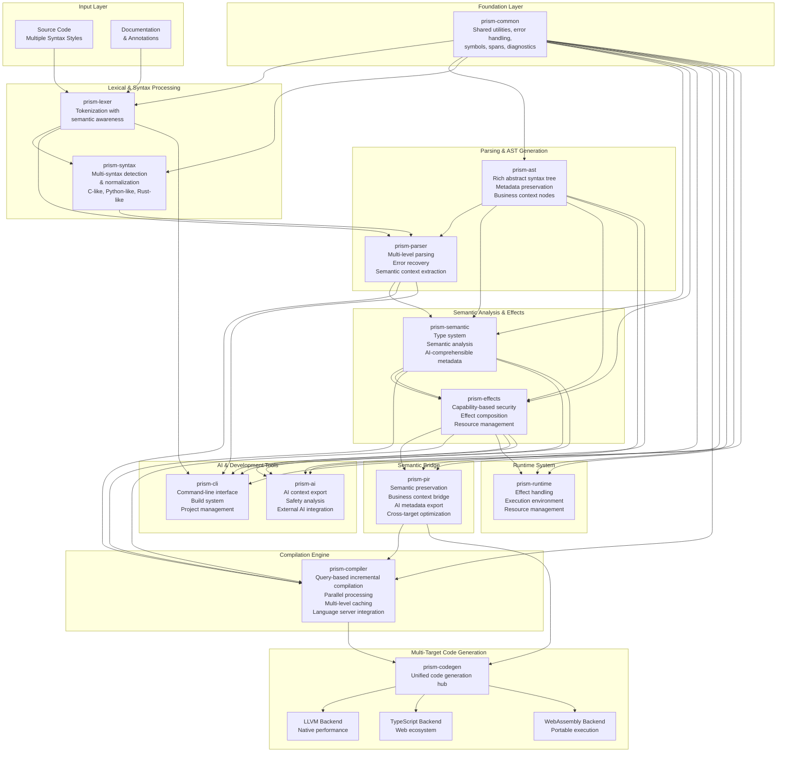

# Prism: Programming Language Overview

## Glossary

**Compiler**: Translates source code into executable programs. *In Prism*: Acts as an intelligent guide that understands your code's intent and suggests improvements.

**AST (Abstract Syntax Tree)**: Internal representation of code structure used by compilers. *In Prism*: Rich tree that preserves business context and generates structured metadata for external AI tools.

**Lexer**: Breaks source code into tokens (keywords, identifiers, operators). *In Prism*: Semantically-aware tokenizer that understands context across multiple syntax styles.

**Parser**: Analyzes token sequences to build the AST according to language grammar rules. *In Prism*: Multi-level parser with error recovery that extracts semantic context.

**Semantic Analysis**: Checks code for meaning and correctness (types, variable usage, etc.). *In Prism*: Generates structured metadata for external AI tools while enforcing safety through effects and capabilities.

**Effect System**: Tracks what functions can do (I/O, memory allocation, etc.). *In Prism*: Capability-based security system that manages resource access and composition.

**PIR (Prism Intermediate Representation)**: Our semantic bridge that preserves business context during compilation while enabling cross-target optimization.

---

## Design Documentation

- **[PLT-000: Conversational Grammar](PLT/PLT-000.md)** - The canonical grammar specification for human-thinking code
- **[PEP Index](PEP/PEP-INDEX.md)** - Prism Enhancement Proposals: Community-driven language improvements
- **[PLD Index](PLD/README.md)** - Prism Language Design: Core language features and specifications  
- **[PLT Index](PLT/PLT-INDEX.md)** - Prism Language Technical: Implementation details and technical specifications
- **[PSG Index](PSG/PSG-INDEX.md)** - Prism Style Guide: Coding conventions and best practices

---

Prism is an AI-first programming language that generates rich, structured metadata enabling seamless collaboration between humans and external AI tools.

## Core Philosophy

Prism is founded on **Conceptual Cohesion**—the idea that code should mirror how developers think about problems. Instead of enforcing arbitrary rules, Prism guides you toward naturally organized, self-explaining code.

**Key Principles:**
- **Clarity Over Brevity**: Explicit, descriptive code beats cryptic shortcuts
- **Guidance Over Enforcement**: The compiler helps rather than restricts
- **AI-Native Design**: Built from the ground up for AI comprehension
- **Safety by Default**: Prevent errors before they happen

## Architecture

The Prism system is built as a pipeline of specialized components, each handling a specific aspect of transforming your code into executable programs:



## 🧠 Human-Centered Design

Prism prioritizes **human mental models** over technical constraints. Every design decision asks: "How do developers actually think about this?"

**🎯 Conceptual Cohesion** - Code organizes around business capabilities, not file structures  
**🔤 Context-Appropriate Naming** - Brief in local scope (`user`), descriptive in APIs (`calculateMonthlyInterest`)  
**🧩 Progressive Complexity** - Simple stays simple, complex requires justification  
**🗣️ Natural Language** - `function` not `fn`, `and` not `&&`, `where` not generics  
**⚡ Cognitive Load Reduction** - Explicit delimiters, consistent patterns, multi-syntax support

### Smart Modules Match Mental Models

Traditional approach scatters related code:
```typescript
models/user.ts     // User definition
validators/user.ts // User validation  
services/user.ts   // User operations
```

Prism matches how developers think:
```prism
module UserManagement {
    section types { /* All user types */ }
    section operations { /* All user functions */ }
    section validation { /* All user rules */ }
}
```

The compiler measures conceptual cohesion and suggests improvements when code doesn't belong together.


## Key Components

### Smart Modules
Instead of rigid file structures, Prism uses **Smart Modules**—files that represent single, cohesive business concepts. Each module is organized into logical sections that the compiler understands:

```prism
// File: UserManagement.prsm
@capability "User Management"
@description "Handles user lifecycle operations"

module UserManagement {
    section types {
        Email = String matching emailRegex;
        UserId = PositiveInteger;
    }
    
    section operations {
        function registerUser(email: Email, password: String) returns Result<UserId> {
            // Registration logic here
        }
    }
}
```

The compiler analyzes your modules and suggests improvements when code doesn't belong together, helping you maintain natural organization.

### Multi-Syntax Support
Write Prism code in the syntax that feels most natural for your team:

- **C-like**: `function getName() { return "Alice"; }`
- **Python-like**: `def get_name(): return "Alice"`  
- **Rust-like**: `fn get_name() -> String { "Alice".to_string() }`

All syntax styles compile to the same semantic representation, so teams can use what they prefer while maintaining compatibility.

### Effect System
Prism tracks what your code can do through a sophisticated effect system:

- **Capability-based security**: Code must declare what resources it needs
- **Effect composition**: Combine effects safely and predictably
- **Resource management**: Automatic tracking of file handles, network connections, etc.

### AI Integration
Every part of Prism is designed for AI comprehension:

- **Rich metadata**: Code carries structured information about its purpose
- **Semantic types**: Types express business rules, not just data structure
- **Self-documenting syntax**: The language itself conveys intent
- **Export capabilities**: Generate AI-readable context from your codebase

### Multi-Target Compilation
Prism compiles to multiple targets:

- **TypeScript**: For rapid prototyping and web development
- **WebAssembly**: For portable, secure execution
- **Native code (LLVM)**: For maximum performance

Start with TypeScript for quick iteration, then compile to native code for production performance.

## Language Innovations

### Documentation as a First-Class Language Feature

**Inspired by**: JSDoc's structured documentation approach and TypeScript's compiler-integrated tooling

Prism treats documentation as executable code that is validated at compile time. Every public function and module must declare its single responsibility through required `@responsibility` annotations, preventing architectural drift and enforcing separation of concerns. The compiler validates documentation completeness, checks for consistency with implementation, and generates AI-readable metadata. This approach eliminates documentation rot by making outdated or missing documentation a compile-time error, similar to how TypeScript prevents type errors.

```prism
what happens when authenticating user?
given credentials: LoginCredentials
expecting valid email format and non-empty password
{
    // First we check if the credentials match our database
    ensure credentials match stored user data
    
    // Then we create a secure session
    create authenticated session for user
}
gives Session or AuthError

// note: validates user credentials against database
// what could go wrong?
// if credentials don't match then return InvalidCredentials
// and tell them "please check your email and password"
```

### Multi-Syntax Support with Semantic Delimiters

**Inspired by**: Go's consistent formatting philosophy and Python's emphasis on readability

Prism supports multiple familiar syntax styles (C-like, Python-like, Rust-like) while using explicit semantic delimiters that eliminate whitespace dependency. Unlike traditional languages where indentation or formatting affects program meaning, Prism's structure is preserved through explicit delimiters that work across any medium - email, forums, documentation, or chat. The compiler automatically converts between syntax styles while maintaining semantic consistency.

```prism
// All equivalent - same semantic meaning across syntax styles

// C-like syntax
module UserAuth {
    function login() -> Result<Session, Error> { /* implementation */ }
}

// Python-like syntax  
module UserAuth:
    def login() -> Result<Session, Error]:
        # implementation

// Canonical conversational syntax (preferred)
what does UserAuth do?
  handles user authentication and session management
  
what happens when user logs in?
given credentials: LoginCredentials
{
    ensure credentials are valid
    create secure session
}
gives Session or AuthError
```

### Smart Module Conceptual Cohesion Measurement

**Inspired by**: Domain-Driven Design principles and software metrics research

The compiler actively measures and reports conceptual cohesion within modules using quantitative metrics. It analyzes type relationships, data flow patterns, semantic naming similarity, and dependency structures to calculate cohesion scores. When code doesn't belong together conceptually, the compiler suggests refactoring opportunities. This system aligns code organization with human mental models rather than arbitrary technical boundaries.

```prism
what does UserManagement do?
  handles everything about users in our system
  manages profiles, preferences, and account lifecycle
  
// cohesion score: 87
// analysis: all user-related types co-located with clear data flow
// suggestion: consider extracting PasswordPolicy to separate module

our types:
  what is User? someone with an account in our system
  what is UserProfile? personal information and preferences
  what is UserSession? active login state and permissions
```

### Prism Intermediate Representation (PIR) Architecture

**Inspired by**: LLVM's IR design and semantic compilation research

PIR serves as a stable contract between compilation orchestration and code generation, preserving all semantic information from source code through the compilation pipeline. Unlike traditional IRs that focus on optimization, PIR maintains business context, AI metadata, and architectural relationships. This enables consistent code generation across multiple targets (TypeScript, WebAssembly, native) while supporting external tool analysis and automated refactoring capabilities.

### Responsibility-Driven Development

**Inspired by**: Clean Architecture principles and linguistic design patterns

The language enforces architectural principles through required responsibility declarations and systematic naming conventions. Every module and function must declare its single responsibility, while naming follows linguistic modifier patterns for consistency and AI comprehension. This approach makes separation of concerns a language feature rather than a coding guideline.

```prism
// Base terms with systematic modifiers following PLT-000 conversational patterns
user → what is user? someone with an account
userBy → how to find user by email?
userWith → what users have premium subscription?  
userFor → which user for this session?
userAll → what are all active users?

validate → what happens when validating data?
validateStrict → how to validate with strict rules?
validateSoft → how to validate with warnings only?
validateBefore → when should validation happen before processing?
```

### Runtime System Architecture

**Inspired by**: WebAssembly's portability model and capability-based security research

The runtime implements a multi-target execution model that maintains security guarantees across JavaScript, WebAssembly, and native compilation targets. Each target has specialized adapters that preserve capability-based security and effect tracking while optimizing for platform-specific performance characteristics. The runtime generates structured metadata during execution and enforces compile-time security policies at runtime.

### Technical Implementation Integration

**Inspired by**: Rust's integrated toolchain and modern compiler architecture research

The technical implementation deeply integrates all language features from lexical analysis through code generation. The multi-syntax lexer generates semantic tokens, the parser creates ASTs with comprehensive metadata export, and the compilation pipeline maintains semantic information through all transformation stages. This integration enables advanced tooling capabilities like real-time cohesion measurement, semantic refactoring, and sophisticated external tool integration.

## Developer Experience

### Intelligent Guidance
The Prism compiler acts as a coding partner:
- Measures code cohesion and suggests improvements
- Provides context-aware error messages that explain both the problem and the solution
- Exports rich metadata that enables sophisticated external tool suggestions

### Safety by Design
- **Immutability by default**: Variables can't change unless explicitly marked mutable
- **Strict type system**: Catch errors at compile time, not runtime  
- **Contract-based programming**: Functions specify their requirements and guarantees

### Progressive Complexity
Start simple and add complexity only when needed:
- High-level operations for common tasks
- Capability-based access to low-level operations when required
- Semantic justification for unsafe operations

## The Vision

Prism reimagines programming for the AI era. Instead of cryptic syntax optimized for minimal keystrokes, Prism prioritizes clarity and comprehension. The result is code that's immediately understandable to both humans and AI systems, enabling unprecedented collaboration between developers and artificial intelligence.

The language doesn't just compile your code—it understands your intent and helps you express it clearly.

---

*For detailed implementation information, see [implementation-plan.md](implementation-plan.md).*
