## **Real-World Benefits of Multi-Target Choice**

### **1. Development Velocity vs Production Performance**

**The Problem**: Traditional languages force you to choose between fast development OR fast execution.

**Prism's Solution**: Get both by switching targets during development:

```bash
# During development - instant feedback
prism compile --target typescript src/ --watch
# Hot reload, instant compilation, rich debugging

# For production - maximum performance  
prism compile --target native src/ --optimize=3
# Native speed, zero runtime overhead
```

### **2. Progressive Development Workflow**

Most real projects follow this pattern:

```mermaid
graph LR
    A[💡 Prototype] --> B[🧪 Test] --> C[📦 Deploy] --> D[🚀 Scale]
    
    A -.-> A1[TypeScript<br/>Fast iteration]
    B -.-> B1[WebAssembly<br/>Cross-platform testing]
    C -.-> C1[WebAssembly<br/>Secure deployment]
    D -.-> D1[Native<br/>Performance critical]
```



**Example Workflow:**
1. **Week 1-2**: Prototype in TypeScript (instant feedback, npm ecosystem)
2. **Week 3**: Test in WebAssembly (verify cross-platform compatibility)
3. **Month 1**: Deploy as WebAssembly (secure, portable)
4. **Month 6**: Optimize critical paths to Native (when performance matters)

### **3. Team Flexibility**

**Different developers prefer different environments:**

```typescript
// Frontend developer comfort zone
npm install @mycompany/user-service
import { registerUser } from '@mycompany/user-service';

// Same Prism code, but they can work with familiar tools
```

```bash
# Backend developer comfort zone  
./user-service --port 8080
# Native binary, no runtime dependencies, familiar deployment
```

### **4. Deployment Environment Optimization**

**Different environments have different constraints:**

| Environment | Best Target | Why |
|-------------|-------------|-----|
| **Development** | TypeScript | Fast compilation, hot reload, debugging tools |
| **CI/CD Testing** | WebAssembly | Consistent across platforms, sandboxed |
| **Edge Computing** | WebAssembly | Portable, secure, fast startup |
| **High-Performance Server** | Native | Maximum throughput, minimal latency |
| **Microservices** | WebAssembly | Lightweight, secure, fast cold starts |
| **System Integration** | Native | Direct OS access, C library integration |

### **5. Risk Mitigation**

**Traditional approach risk:**
```bash
# All eggs in one basket
my_app.exe  # What if this has a critical bug in production?
```

**Prism approach:**
```bash
# Multiple deployment options from same source
my_app.exe        # Native for performance
my_app.wasm       # WebAssembly fallback
my_app.js         # JavaScript for debugging
```

If one target has issues, you can quickly switch without rewriting code.

### **6. Ecosystem Integration**
**Each target integrates with completely different ecosystems:**

### **TypeScript Target → JavaScript Ecosystem**
```bash
# Generated TypeScript integrates with Node.js ecosystem
npm install express mongoose redis
import { PrismRuntime } from '@prism/runtime';
import express from 'express';  # Instant access to npm packages
```

### **WebAssembly Target → Universal Runtime**
```bash
# Same Prism code runs in browsers, edge computing, serverless
wasmtime my_app.wasm    # Wasmtime runtime
# Or in browser, Cloudflare Workers, AWS Lambda@Edge
```

### **Native Target → System Integration**
```bash
# Generated native code integrates with system libraries
./my_app  # Direct OS integration, C library access, maximum performance
```

## **7. Cost and Resource Optimization**

**Different targets have different cost profiles:**

| Scenario | Best Target | Cost Benefit |
|----------|-------------|--------------|
| **Development** | TypeScript | Fast iteration = Lower dev costs |
| **Testing/CI** | WebAssembly | Consistent across platforms = Lower testing costs |
| **Edge Computing** | WebAssembly | Fast cold starts = Lower compute costs |
| **High-Traffic API** | Native | Maximum throughput = Lower infrastructure costs |
| **Multi-Cloud** | WebAssembly | Portable = Lower vendor lock-in risk |

## **8. Future-Proofing**

**Technology landscapes change:**

```bash
# Today: Deploy to traditional servers
prism compile --target native

# Tomorrow: New platform emerges (e.g., quantum computing)
prism compile --target quantum  # Same source code, new target

# Next year: Edge computing becomes standard
prism compile --target wasm-edge  # Instantly ready
```

## **9. A/B Testing and Gradual Migration**

**Real-world example:**

```bash
# Week 1: Deploy TypeScript version (fast to market)
prism compile --target typescript src/
kubectl apply -f typescript-deployment.yaml

# Week 2: A/B test with WebAssembly version (better performance)
prism compile --target wasm src/
kubectl apply -f wasm-deployment.yaml  # Same source, different performance

# Week 3: Critical path gets native optimization
prism compile --target native src/auth-service/
# Only the auth service runs native, rest stays WASM
```

## **10. Developer Experience Benefits**

**No context switching:**

```prism
// Same Prism code
function authenticateUser(token: JWTToken) -> Result<User> {
    // Business logic here
}
```

**But different development experiences:**

```bash
# Frontend developer
prism compile --target typescript --watch
# Gets: Hot reload, browser debugging, npm ecosystem

# DevOps engineer  
prism compile --target native --optimize=3
# Gets: Single binary, no dependencies, container optimization

# Platform engineer
prism compile --target wasm
# Gets: Sandboxed security, portable deployment, consistent behavior
```

## **The Strategic Advantage**

The ability to choose compilation targets gives you **options at every stage**:

- **Start fast** with TypeScript
- **Scale securely** with WebAssembly  
- **Optimize performance** with Native
- **Adapt to new platforms** as they emerge

This isn't just a technical feature - it's a **business strategy** that lets you optimize for **time-to-market**, **cost efficiency**, **performance requirements**, and **future adaptability** all from the same codebase.

**Bottom line**: You write business logic once in Prism, then optimize deployment strategy based on current needs, without rewriting code or changing teams.