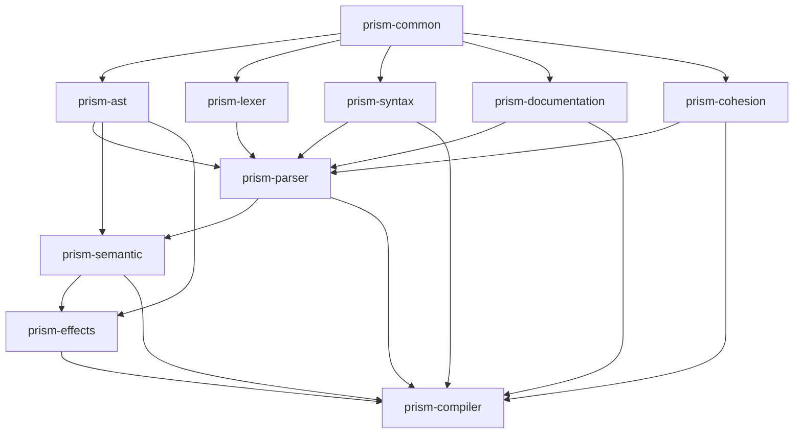

I'll analyze the current crate structure and recommend the optimal organization for implementing the missing PLT-001 features.
Search files...
Based on my analysis of the current crate structure and PLT-001 requirements, here's my recommended crate organization for implementing the missing features:
Ran tool
## 🏗️ Optimal Crate Organization for PLT-001 Implementation

### **Current Structure Assessment:**
✅ **Well-Designed Foundation** - Current crate separation is excellent  
❌ **Missing PLT-001 Specific Crates** - Need specialized crates for missing features

---

## 📦 **RECOMMENDED CRATE STRUCTURE**

### **1. KEEP EXISTING** (No Changes Needed)
```
✅ prism-common/          # Shared utilities - perfect as-is
✅ prism-ast/             # Core AST - excellent foundation  
✅ prism-lexer/           # Lexical analysis - good base
✅ prism-parser/          # Parser core - solid foundation
✅ prism-semantic/        # Semantic analysis - well done
✅ prism-effects/         # Effect system - comprehensive
✅ prism-codegen/         # Code generation - good structure
✅ prism-compiler/        # Query engine - well architected
✅ prism-runtime/         # Runtime support - appropriate
```

### **2. NEW CRATES NEEDED** (Create These)

#### **A. Multi-Syntax Support** 🎯 **Priority 1**
```rust
📦 prism-syntax/          # NEW - Multi-syntax parsing engine
├── src/
│   ├── lib.rs           # Multi-syntax coordinator
│   ├── c_like.rs        # C/Java/JavaScript syntax parser
│   ├── python_like.rs   # Python/CoffeeScript syntax parser  
│   ├── rust_like.rs     # Rust/Go syntax parser
│   ├── canonical.rs     # Prism canonical syntax parser
│   ├── detection.rs     # Syntax style auto-detection
│   ├── conversion.rs    # Cross-syntax AST conversion
│   └── validation.rs    # Multi-syntax validation
└── Cargo.toml

Dependencies: prism-common, prism-ast, prism-lexer, prism-parser
```

#### **B. Documentation System** 🎯 **Priority 2**  
```rust
📦 prism-documentation/   # NEW - PSG-003 documentation validation
├── src/
│   ├── lib.rs           # Documentation system coordinator
│   ├── validation.rs    # Required annotation validation
│   ├── jsdoc.rs         # JSDoc compatibility layer
│   ├── extraction.rs    # Documentation extraction from AST
│   ├── generation.rs    # Documentation generation
│   ├── requirements.rs  # PSG-003 requirement checking
│   └── ai_integration.rs # AI-readable doc metadata
└── Cargo.toml

Dependencies: prism-common, prism-ast, regex, serde
```

#### **C. Cohesion Analysis** 🎯 **Priority 3**
```rust  
📦 prism-cohesion/       # NEW - PLD-002 conceptual cohesion
├── src/
│   ├── lib.rs           # Cohesion analysis coordinator
│   ├── metrics.rs       # Cohesion metric calculation
│   ├── analysis.rs      # Conceptual boundary analysis
│   ├── boundaries.rs    # Responsibility scope detection
│   ├── violations.rs    # Cohesion violation detection
│   ├── suggestions.rs   # Improvement suggestions
│   └── ai_insights.rs   # AI-comprehensible cohesion data
└── Cargo.toml

Dependencies: prism-common, prism-ast, petgraph, rustc-hash
```

### **3. ENHANCE EXISTING CRATES** (Add Missing Features)

#### **A. Extend `prism-parser/`** ⚡ **High Priority**
```rust
# Add to existing prism-parser/src/:
├── multi_syntax.rs      # Multi-syntax integration layer
├── documentation.rs     # Documentation parsing (@annotations)
├── cohesion.rs          # Real-time cohesion tracking
├── module_system.rs     # Complete PLD-002 module parsing
└── integration.rs       # Full subsystem integration
```

#### **B. Extend `prism-ast/`** ⚡ **Medium Priority**  
```rust
# Add to existing prism-ast/src/:
├── documentation.rs     # Documentation AST nodes
├── modules.rs           # Enhanced module system nodes
├── cohesion.rs          # Cohesion metadata nodes
└── multi_syntax.rs      # Syntax-aware AST nodes
```

#### **C. Extend `prism-compiler/`** ⚡ **Low Priority**
```rust  
# Add to existing prism-compiler/src/:
├── multi_syntax.rs      # Multi-syntax compilation
├── documentation.rs     # Documentation validation in compilation
└── cohesion.rs          # Cohesion analysis in compilation
```

---

## 🎯 **IMPLEMENTATION STRATEGY**

### **Phase 1: Multi-Syntax Foundation** (Week 1-2)
1. **Create `prism-syntax/`** - New crate for multi-syntax parsing
2. **Enhance `prism-parser/`** - Add multi-syntax integration
3. **Extend `prism-ast/`** - Add syntax-aware nodes

### **Phase 2: Documentation System** (Week 3)  
1. **Create `prism-documentation/`** - New crate for PSG-003
2. **Enhance `prism-parser/`** - Add documentation parsing
3. **Integration testing** - Validate documentation requirements

### **Phase 3: Cohesion Analysis** (Week 4)
1. **Create `prism-cohesion/`** - New crate for PLD-002  
2. **Enhance `prism-parser/`** - Add cohesion tracking
3. **Integration testing** - Validate cohesion metrics

### **Phase 4: Full Integration** (Week 5)
1. **Enhance `prism-compiler/`** - Integrate all systems
2. **End-to-end testing** - Complete PLT-001 validation
3. **Performance optimization** - Benchmark and optimize

---

## 📋 **DEPENDENCY GRAPH**



---

## ✅ **RATIONALE FOR NEW CRATES**

### **Why `prism-syntax/`?**
- **Separation of Concerns**: Multi-syntax parsing is complex enough to warrant its own crate
- **Reusability**: Other tools (formatters, linters) can use syntax detection independently  
- **Maintainability**: Easier to test and maintain syntax-specific logic separately

### **Why `prism-documentation/`?**  
- **PSG-003 Compliance**: Documentation validation is a complete subsystem
- **Tool Integration**: IDEs and docs tools need standalone documentation analysis
- **AI Integration**: Documentation metadata generation is specialized functionality

### **Why `prism-cohesion/`?**
- **PLD-002 Complexity**: Cohesion analysis involves graph algorithms and complex metrics
- **Performance**: Cohesion analysis can be computationally expensive, needs optimization
- **Research**: Cohesion metrics may evolve, easier to iterate in separate crate

---

## 🚀 **NEXT STEPS**

**Ready to proceed with implementation?** The crate structure is optimized for:
- ✅ **Parallel Development** - Each crate can be developed independently
- ✅ **Clean Dependencies** - No circular dependencies
- ✅ **Testability** - Each crate can be thoroughly tested in isolation  
- ✅ **Performance** - Specialized crates can be optimized for their specific domains

**Let's start with Phase 1: Multi-Syntax Foundation** - Create `prism-syntax/` crate and begin implementing the multi-syntax parser architecture!