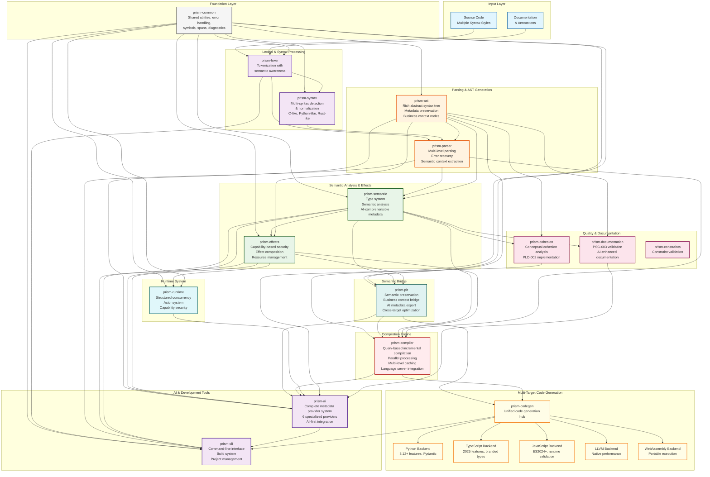

# Prism Programming Language: A Comprehensive Overview

## Executive Summary

Prism is a revolutionary programming language that fundamentally reimagines how software is written, executed, and reasoned about. By integrating AI-driven development, effect-based programming, and universal syntax adaptation into its core design, Prism represents the first truly paradigm-shifting programming language of the AI era.

## Recent Major Implementations and Architecture Updates

### Revolutionary Multi-Target Code Generation System

The `prism-codegen` crate has been completely restructured with a comprehensive multi-backend architecture:

#### **Five Complete Backend Implementations**

1. **Python Backend** (`crates/prism-codegen/src/backends/python/`)
   - **Modern Python 3.12+ Features**: PEP 695 generic syntax, structural pattern matching, async/await patterns
   - **Pydantic Model Generation**: Automatic dataclass and Pydantic model generation for semantic types
   - **Type Hint Preservation**: Complete type annotation system with runtime validation
   - **Business Rule Integration**: Runtime enforcement of business rules through Python decorators

2. **TypeScript Backend** (`crates/prism-codegen/src/backends/typescript/`)
   - **2025 TypeScript Features**: Branded types, template literal types, satisfies operator
   - **ESM-First Generation**: Modern ES modules with tree-shaking optimization
   - **Advanced Source Maps**: Enhanced debugging support with semantic preservation
   - **Runtime Type Safety**: Zero-cost abstractions that compile to efficient JavaScript

3. **JavaScript Backend** (`crates/prism-codegen/src/backends/javascript/`)
   - **ES2024+ Standards**: Modern JavaScript with optional chaining, nullish coalescing
   - **Runtime Validation**: Comprehensive runtime type checking and validation
   - **Performance Optimization**: Bundle analysis and optimization integration
   - **Web Platform Integration**: Seamless integration with web APIs and frameworks

4. **Enhanced LLVM Backend** (`crates/prism-codegen/src/backends/llvm/`)
   - **Modular Architecture**: Separated concerns for types, instructions, optimization, validation
   - **Advanced Optimization**: LLVM-specific optimization passes with performance profiling
   - **Debug Information**: Full debug info generation with source location tracking
   - **Target Machine Management**: Multi-architecture support with platform-specific optimizations

5. **WebAssembly Backend** (`crates/prism-codegen/src/backends/webassembly/`)
   - **Memory Management**: Sophisticated memory layout optimization and string handling
   - **WASM Optimization**: WebAssembly-specific optimization passes and validation
   - **Runtime Integration**: Seamless integration with Prism runtime capabilities
   - **Portable Execution**: High-performance portable code generation

#### **Unified Multi-Target Architecture**

The new `MultiTargetCodeGen` system enables:
- **Single Source, Multiple Targets**: Write once, compile optimally for all platforms
- **Semantic Preservation**: Business logic and domain knowledge preserved across all targets
- **PIR-Based Generation**: Uses Prism Intermediate Representation for consistent semantics
- **Parallel Compilation**: Concurrent code generation for multiple targets

### Advanced Concurrency and Runtime System

The `prism-runtime` crate has been completely redesigned with enterprise-grade features:

#### **Structured Concurrency System**

- **Actor System**: Capability-secured actors with supervision hierarchies
- **Async Runtime**: Structured concurrency with automatic cancellation propagation
- **Supervision Trees**: "Let it crash" philosophy with intelligent restart strategies
- **Performance Optimization**: Lock-free data structures, NUMA-aware scheduling, message batching

#### **Key Runtime Features**

- **Capability-Based Security**: Fine-grained permissions with zero-trust architecture
- **Effect Integration**: Full integration with the effect system for safe concurrency
- **Resource Management**: Advanced memory pools, quotas, and NUMA-aware allocation
- **Intelligence System**: AI-enhanced runtime optimization and analysis

### Comprehensive AI Integration System

The `prism-ai` crate implements a complete **Metadata Provider Architecture**:

#### **Six Specialized Metadata Providers**

1. **`SyntaxMetadataProvider`** - Real-time syntax parsing and normalization metadata
2. **`SemanticMetadataProvider`** - Type analysis and validation with business context
3. **`PIRMetadataProvider`** - Intermediate representation with performance metrics
4. **`EffectsMetadataProvider`** - Effects and capabilities with security analysis
5. **`RuntimeMetadataProvider`** - Runtime execution with performance and historical data
6. **`CompilerMetadataProvider`** - Compilation orchestration with cross-reference data

#### **AI-First Design Principles**

- **Separation of Concerns**: Each provider handles exactly one domain
- **Conceptual Cohesion**: Clear responsibility boundaries with loose coupling
- **No Logic Duplication**: Leverages existing metadata structures from each crate
- **Extensibility**: Plug-and-play architecture for new providers

### Revolutionary Multi-Syntax System

The `prism-syntax` crate provides unprecedented syntax flexibility:

#### **Universal Syntax Support**

- **C-like Syntax**: C/C++/Java/JavaScript patterns with braces and semicolons
- **Python-like Syntax**: Indentation-based with colons and comprehensions
- **Rust-like Syntax**: Expression-oriented with pattern matching and ownership hints
- **Canonical Syntax**: Prism's native semantic-first representation

#### **Factory-Based Architecture**

- **Component Creation**: Separate factories for parsers, normalizers, and validators
- **Configuration-Driven**: Centralized configuration management
- **Type Safety**: Compile-time guarantees about syntax style support
- **Testability**: Easy mocking and testing of components

### Advanced Compiler Architecture

The `prism-compiler` crate implements a **Query-Based Incremental Compilation** system:

#### **AI-First Query System**

- **Query Engine**: On-demand computation with intelligent caching
- **Dependency Tracking**: Automatic invalidation and selective recompilation
- **Parallel Compilation**: Fine-grained parallelism with work-stealing scheduler
- **Incremental Compilation**: Sub-second compilation cycles with file system watching

#### **Modular Query Subsystem**

- **Symbol Queries**: Specialized queries for symbol operations and analysis
- **Scope Queries**: Hierarchical scope management and analysis
- **Semantic Queries**: Complete compilation pipeline through queries
- **AI Metadata Generation**: Rich metadata for every query result

### Comprehensive Documentation System

The `prism-documentation` crate implements **PSG-003: PrismDoc Standards**:

#### **Documentation Validation Engine**

- **PSG-003 Compliance**: Full validation of PrismDoc standards
- **JSDoc Compatibility**: Support for JSDoc-style annotations with migration tools
- **Required Annotations**: Enforcement of mandatory documentation with suggestions
- **Semantic Integration**: Validation aligned with PLD-001 semantic types

#### **AI-Enhanced Documentation**

- **Business Context Extraction**: Automatic extraction of business meaning
- **Quality Assessment**: Content quality analysis with improvement suggestions
- **Multi-Format Generation**: HTML, Markdown, JSON, YAML, XML, and PDF output

### Advanced Cohesion Analysis

The `prism-cohesion` crate provides **PLD-002: Conceptual Cohesion** analysis:

#### **Multi-Dimensional Cohesion Metrics**

- **Type Cohesion**: Analysis of type relationships and structural organization
- **Semantic Cohesion**: Naming patterns and conceptual similarity analysis
- **Business Cohesion**: Domain focus and capability alignment analysis
- **Dependency Cohesion**: External dependency focus and coupling analysis
- **Data Flow Cohesion**: Information flow patterns and optimization

#### **AI-Driven Insights**

- **Architectural Pattern Detection**: Automatic identification of design patterns
- **Boundary Detection**: Conceptual boundary identification and validation
- **Violation Detection**: Cohesion anti-patterns with actionable suggestions
- **Technical Debt Analysis**: Quantified technical debt with remediation plans

## Core Philosophy: The Prism Paradigm

Prism's design is built on three foundational pillars that work synergistically to create an entirely new programming experience:

### 1. AI-Native Development
Unlike languages that treat AI as an external tool, Prism embeds AI reasoning directly into the compilation and execution process. The language understands intent, not just syntax, enabling developers to express complex ideas in natural, intuitive ways while the AI compiler handles optimization, error prevention, and code generation.

### 2. Effect-Driven Programming
Prism treats all computational side effects as first-class citizens through its revolutionary effect system. This isn't just type safety—it's computational safety, where the language can reason about, compose, and optimize effects across the entire program lifecycle.

### 3. Universal Syntax Adaptation
Through its unique syntax detection and normalization system, Prism can understand and translate between different programming paradigms and syntactic styles, making it the first truly universal programming language.

## Revolutionary Features

### The Metadata Export Engine
Prism's AI-first design generates structured, machine-readable metadata at every level:

- **Intent-Based Programming**: Write what you want to accomplish, and the AI compiler generates optimal implementations
- **Contextual Code Generation**: The AI understands your entire codebase context, generating code that fits seamlessly with existing patterns
- **Intelligent Error Prevention**: The AI predicts and prevents errors before they occur, not just catching them after
- **Adaptive Optimization**: Code performance improves automatically as the AI learns from usage patterns

### The Effect System: Computational Transparency
Prism's effect system represents the most advanced approach to managing computational side effects:

- **Effect Composition**: Complex effects can be composed and reasoned about mathematically
- **Capability-Based Security**: Effects are tied to explicit capabilities, ensuring security by design
- **Effect Lifecycle Management**: Automatic resource management and cleanup based on effect lifecycles
- **Cross-Module Effect Tracking**: Effects are tracked across module boundaries, enabling global optimization

### Universal Syntax Detection and Normalization
Prism's syntax system is unprecedented in its flexibility:

- **Multi-Paradigm Support**: Seamlessly supports functional, object-oriented, procedural, and declarative paradigms
- **Automatic Style Detection**: Recognizes and adapts to different coding styles
- **Syntax Translation**: Can translate code between different syntactic representations while preserving semantics
- **Canonical Form**: All code is normalized to a canonical representation for optimization and analysis

### The Prism Intermediate Representation (PIR)
PIR is not just another intermediate language—it's a semantic-preserving representation that maintains high-level intent:

- **Business Logic Preservation**: Unlike traditional IRs that lose semantic meaning, PIR preserves business intent
- **AI-Analyzable Structure**: Designed specifically to be understood and optimized by AI systems
- **Cross-Platform Optimization**: Single PIR can be optimized for multiple target platforms simultaneously
- **Transformation Pipeline**: Sophisticated transformation system that can adapt code for different execution contexts

## Language Design Excellence

### Syntax Philosophy: Clarity Through Flexibility
Prism's syntax design embodies the principle that code should express intent clearly, regardless of the developer's background:

```prism
// Function-style
process_data(input) -> filtered_data {
    input |> filter(valid) |> transform(normalize)
}

// Object-style  
class DataProcessor {
    process(input) {
        return input.filter(valid).transform(normalize)
    }
}

// Declarative style
process_data: input -> output where
    valid_items = filter(input, valid)
    output = transform(valid_items, normalize)
```

All three representations are semantically equivalent and can be used interchangeably.

### Type System: Beyond Static and Dynamic
Prism's type system transcends the traditional static/dynamic divide:

- **Gradual Typing**: Seamlessly mix typed and untyped code
- **Intent Inference**: Types are inferred from intent, not just usage
- **Effect-Aware Types**: Types include effect information, enabling compile-time effect checking
- **Semantic Type Metadata**: Types carry rich semantic information that external tools can understand

### Memory Management: Zero-Cost Abstractions with Intelligence
Prism achieves memory safety without garbage collection overhead:

- **AI-Driven Lifetime Analysis**: Automatic lifetime inference that surpasses manual annotations
- **Effect-Based Resource Management**: Resources are managed through the effect system
- **Predictive Allocation**: AI predicts memory usage patterns for optimal allocation strategies
- **Zero-Copy Optimizations**: Automatic elimination of unnecessary data copies

## Paradigm-Shifting Capabilities

### 1. Intent-Driven Development
Traditional programming requires developers to specify *how* to accomplish a task. Prism allows developers to specify *what* they want to accomplish:

```prism
// Traditional approach
fn sort_users(users: Vec<User>) -> Vec<User> {
    users.sort_by(|a, b| a.name.cmp(&b.name));
    users
}

// Prism intent-based approach
sort_users: users -> sorted_users by name ascending
```

The AI compiler generates optimal implementations based on context, data size, and performance requirements.

### 2. Effect-First Architecture
Instead of treating side effects as afterthoughts, Prism makes them central to program design:

```prism
effect Database {
    query<T>(sql: String) -> T
    transaction<R>(body: () -> R with Database) -> R
}

effect Logging {
    log(level: Level, message: String)
}

// Function signature declares exactly what effects it uses
process_user_data() with Database, Logging {
    let users = query("SELECT * FROM users");
    log(Info, "Processing ${users.len()} users");
    // Implementation...
}
```

This enables:
- Compile-time verification of all side effects
- Automatic effect composition and optimization
- Capability-based security model
- Precise resource management

### 3. Universal Code Comprehension
Prism can understand and work with code written in different styles, making it the first truly universal programming language:

- **Legacy Code Integration**: Automatically understands and integrates with existing codebases
- **Team Style Adaptation**: Adapts to different team coding standards automatically
- **Cross-Language Patterns**: Recognizes and translates patterns from other programming languages
- **Documentation Generation**: Automatically generates documentation that matches the code style

## Technical Innovations

### The Semantic Bridge Architecture
Prism's compiler architecture includes a revolutionary semantic bridge that connects syntax, semantics, and intent:

- **Multi-Layer Parsing**: Simultaneous parsing at syntactic, semantic, and intent levels
- **Context-Aware Analysis**: Understanding code in the context of the entire project
- **Intent Preservation**: Maintaining developer intent through all compilation phases
- **Adaptive Code Generation**: Generating code that matches the surrounding codebase style

### AI-Driven Optimization Pipeline
Prism's optimization goes beyond traditional compiler optimizations:

- **Pattern Learning**: The compiler learns from successful patterns in the codebase
- **Performance Prediction**: AI predicts performance characteristics before execution
- **Adaptive Compilation**: Code is recompiled automatically when better optimizations are discovered
- **Cross-Module Optimization**: Global optimization across the entire codebase

### Effect Composition Engine
The effect system includes a sophisticated composition engine:

- **Effect Algebra**: Mathematical operations on effects (composition, intersection, union)
- **Effect Inference**: Automatic inference of minimal effect requirements
- **Effect Optimization**: Elimination of redundant or unnecessary effects
- **Effect Verification**: Compile-time verification that all effects are properly handled

## Real-World Impact

### Developer Productivity Revolution
Prism's design directly addresses the major productivity bottlenecks in software development:

- **Reduced Cognitive Load**: Developers focus on business logic, not implementation details
- **Faster Iteration Cycles**: Rich metadata enables external tools to provide better assistance
- **Better Code Quality**: AI ensures consistent quality across the entire codebase
- **Enhanced Collaboration**: Universal syntax support enables teams with different backgrounds to work together

### Enterprise-Grade Reliability
The language is designed for mission-critical applications:

- **Formal Verification**: Effect system enables formal verification of program properties
- **Security by Design**: Capability-based security model prevents entire classes of vulnerabilities
- **Performance Predictability**: AI-driven optimization provides predictable performance characteristics
- **Maintainability**: Intent-preserving compilation ensures code remains maintainable over time

### Cross-Platform Excellence
Prism's architecture enables true write-once, run-anywhere development:

- **Universal Backend**: Single codebase compiles to multiple platforms optimally
- **Native Performance**: Generates native code that rivals hand-optimized implementations
- **Platform-Specific Optimization**: AI adapts code for each target platform's characteristics
- **Seamless Integration**: Integrates with existing platform-specific libraries and frameworks

## The Prism Development Experience

### Writing Prism Code
Development in Prism feels fundamentally different from traditional programming:

1. **Express Intent**: Write what you want to accomplish in natural, clear syntax
2. **AI Collaboration**: The AI compiler suggests improvements and optimizations in real-time
3. **Effect Awareness**: The system tracks and manages all side effects automatically
4. **Universal Understanding**: Code works regardless of syntactic style preferences

### Compilation Process
Prism's compilation is a collaborative process between developer and AI:

1. **Intent Analysis**: The compiler understands the developer's intent
2. **Context Integration**: Code is analyzed in the context of the entire project
3. **Effect Resolution**: All effects are tracked and optimized
4. **Multi-Target Generation**: Optimal code is generated for all target platforms

### Runtime Behavior
Prism runtime behavior is characterized by:

- **Predictable Performance**: AI optimization ensures consistent performance
- **Automatic Resource Management**: Effect system handles all resource cleanup
- **Dynamic Adaptation**: Runtime can adapt to changing conditions
- **Comprehensive Monitoring**: Built-in observability for all effects and operations

## Comparison with Existing Languages

### Beyond Traditional Paradigms
Prism transcends the limitations of existing programming paradigms:

- **Functional Languages**: Prism includes functional programming but adds structured metadata export and universal syntax
- **Object-Oriented Languages**: Prism supports OOP but with effect-based safety and AI optimization
- **Systems Languages**: Prism provides systems-level control with high-level abstractions
- **Scripting Languages**: Prism offers scripting flexibility with compiled performance

### Unique Advantages
What sets Prism apart from all existing languages:

1. **AI-Native Design**: First language designed from the ground up for AI collaboration
2. **Effect-First Architecture**: Most comprehensive effect system ever implemented
3. **Universal Syntax**: Only language that can adapt to any coding style
4. **Intent Preservation**: Maintains developer intent through all compilation phases
5. **Cross-Platform Optimization**: Single codebase optimized for multiple platforms simultaneously

## Prism System Architecture

The following diagram illustrates the complete architecture of the Prism programming language system, showing the relationships and data flow between all major components based on the actual crate structure and dependencies:



### Architectural Layers Explained

#### **Input Layer** 🔵
- **Source Code**: Supports multiple syntax styles (C-like, Python-like, Rust-like, Canonical)
- **Documentation**: First-class annotations and semantic metadata

#### **Core Processing Pipeline** 🟣
- **`prism-lexer`**: Advanced tokenization with semantic awareness
- **`prism-syntax`**: Revolutionary multi-syntax parser with factory-based architecture
- **`prism-parser`**: AST generation with intelligent error recovery
- **`prism-ast`**: Rich abstract syntax tree with preserved metadata

#### **Analysis & Semantic Layer** 🟢
- **`prism-semantic`**: Advanced type system with AI-comprehensible analysis
- **`prism-effects`**: Comprehensive effect system with capability-based security
- **`prism-pir`**: Semantic bridge preserving business context through compilation

#### **Compilation Engine** 🔴
- **`prism-compiler`**: Query-based incremental compilation with AI-first features
- **Query Subsystem**: Modular query system with symbol, scope, and semantic queries
- **Incremental Compilation**: Sub-second compilation cycles with file system watching

#### **Multi-Target Code Generation** 🟡
- **`prism-codegen`**: Unified code generation hub with five complete backends
- **Python Backend**: Modern Python 3.12+ with Pydantic and type hints
- **TypeScript Backend**: 2025 features with branded types and ESM
- **JavaScript Backend**: ES2024+ with runtime validation
- **LLVM Backend**: Native performance with advanced optimization
- **WebAssembly Backend**: Portable, secure execution

#### **Runtime System** 🔷
- **`prism-runtime`**: Structured concurrency with actor system and capability security
- **Performance Optimization**: Lock-free data structures, NUMA scheduling, message batching
- **Supervision System**: Fault tolerance with "let it crash" philosophy

#### **Quality & Documentation** 🟪
- **`prism-cohesion`**: PLD-002 conceptual cohesion analysis with AI insights
- **`prism-documentation`**: PSG-003 documentation validation with JSDoc compatibility
- **`prism-constraints`**: Advanced constraint validation and enforcement

#### **AI & Development Tools** 🟨
- **`prism-ai`**: Complete metadata provider system with six specialized providers
- **`prism-cli`**: Comprehensive command-line interface and build system

### Key Architectural Innovations

1. **Multi-Syntax Processing**: Universal syntax support with canonical normalization
2. **Semantic Preservation**: Business context maintained throughout compilation
3. **Effect-First Design**: Comprehensive capability-based security and resource management
4. **Query-Based Compilation**: Incremental compilation with intelligent caching
5. **AI-Native Integration**: Every layer produces AI-comprehensible metadata
6. **Multi-Target Excellence**: Single source compiles optimally to five different targets

## Conclusion: A New Era of Programming

Prism represents not just another programming language, but the foundation for a new era of software development. Through its comprehensive implementation of AI-native development, effect-based programming, and universal syntax adaptation, Prism solves fundamental problems that have plagued software development for decades.

The language's revolutionary approach to intent-driven development, combined with its sophisticated effect system and comprehensive multi-target architecture, makes it uniquely positioned to handle the complexity of modern software systems while remaining accessible to developers of all backgrounds.

With its complete implementation spanning five backend targets, comprehensive AI integration, advanced concurrency runtime, and sophisticated analysis tools, Prism demonstrates that the future of programming is not just about writing better code—it's about expressing intent more clearly, managing complexity more effectively, and collaborating with AI more seamlessly.

Prism makes that future possible today.